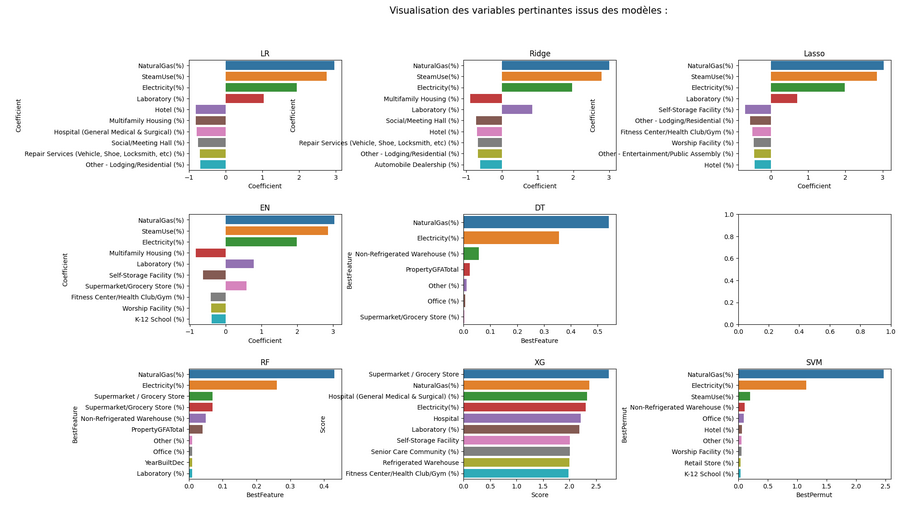
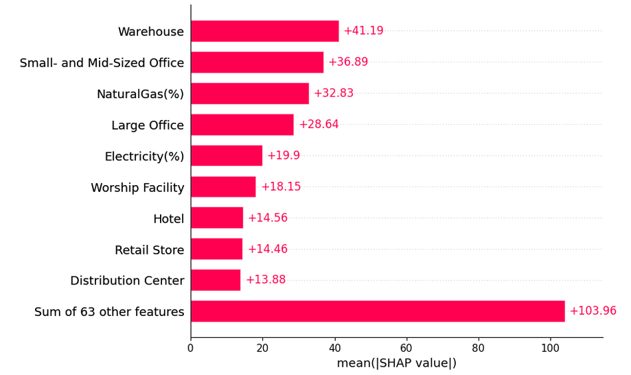

# Projet_Perso_Anticipation_Besoins_Consommation_Bâtiments

## **📌 Contexte et Objectif**

**Entreprise :** Ville de Seattle  
**Logo :** 

### **🎯 Objectif**  
Le projet a pour objectif d'anticiper la consommation d'énergie et les émissions de CO2 des bâtiments non résidentiels de la ville de Seattle en 2016. L'objectif est de prédire ces valeurs pour des bâtiments pour lesquels les données de consommation ne sont pas disponibles, en utilisant les données des bâtiments existants.

### **📂 Jeux de données**  
- **Données :** [Consulter le dataset](https://s3.eu-west-1.amazonaws.com/course.oc-static.com/projects/Data_Scientist_P4/2016_Building_Energy_Benchmarking.csv)

### **🔍 Problématiques étudiées :**  
- Prédire la consommation d'énergie et les émissions de CO2 pour des bâtiments non résidentiels.
- Évaluer l’intérêt de l'**ENERGY STAR Score** pour la prédiction des émissions et tester son intégration dans le modèle.
- Identifier des variables structurelles des bâtiments à partir des primo-relevés de consommation.

---

## **🚀 Réalisations et Méthodologie**

### **1️⃣ Exploration des données**  
- **Ouverture et nettoyage des données :** Étude de la qualité des données, vérification des valeurs manquantes et exploration des variables.
- **Exploration géographique :** Cartographie de la localisation des bâtiments sur la ville de Seattle.
  
  

- **Analyse des variables de consommation des bâtiments :** Évaluation des variables pertinentes et des valeurs aberrantes.

  

- **Gestion des outliers et création de nouvelles variables :** Identification des outliers et création de nouvelles variables comme le **type de bâtiment** et les **décennies de construction**.

  

- **Transformation des données :** Normalisation des variables et utilisation du **skew** pour corriger les asymétries dans les distributions des données.

  

### **2️⃣ Prédiction de la consommation et des émissions (Targets)**  
#### **Modèles de Machine Learning utilisés :**  
- **Régression Linéaire** : Ridge, Lasso, ElasticNet  
- **Arbre de Décision (Decision Tree)** : Ajustement des hyperparamètres (max_depth)  
- **K-Nearest Neighbors (KNN)** : Optimisation du nombre de voisins (n_neighbors)  
- **Random Forest** : Ajustement de (n_estimators, max_features...)  
- **XGBoost** : Optimisation des paramètres (learning_rate, subsample...)  
- **Support Vector Machine (SVM)** : Tuning de (C_range)  
- **Dummy & Random Models** pour comparaison de base.

#### **Mesures de performance :**  
- **RMSE** (Root Mean Squared Error)  
- **R²** (coefficient de détermination)  
- **Temps de calcul** pour évaluer l'efficacité des modèles.

### **3️⃣ Analyse des Variables Importantes**  
- **Importance des caractéristiques (Feature Importance) :**  
  

- **Interprétation des modèles via SHAP et LIME** :  
  

---

## **📈 Résultats et Insights**

- **Prédictions de consommation :** Les modèles ont permis de prédire la consommation d'énergie des bâtiments non résidentiels avec une précision acceptable.
- **Importance du ENERGY STAR Score :** Son intégration a amélioré les performances des modèles, notamment en ce qui concerne les bâtiments ayant un score élevé.
- **Recommandations :** Utiliser l'**ENERGY STAR Score** comme un indicateur fiable pour prédire la consommation énergétique des bâtiments à faible consommation.

---

## **🛠️ Technologies et Outils Utilisés**

- **Langage :** Python 🐍
- **Librairies :** Pandas, Numpy, Seaborn, Matplotlib, Folium, Scikit-learn, XGBoost, SHAP, LIME
- **Environnement :** Jupyter Notebook
- **Méthodes utilisées :** Data cleaning, Data visualization, Machine learning, Feature engineering

---

## **📬 Contact et Feedback**

💡 Ce projet a été réalisé dans le cadre de ma **formation Data Science**. N’hésitez pas à **laisser vos suggestions** ou à **me contacter** pour en discuter !  

📩 **Contact :**  
📧 [johan.rocheteau@hotmail.fr](mailto:johan.rocheteau@hotmail.fr)  
🔗 [LinkedIn](https://www.linkedin.com/in/johan-rocheteau)
